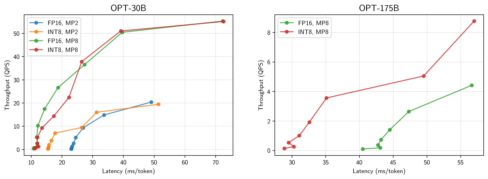

## FasterTransformer

As an alternative to the [API](api.md) provided by Metaseq, you can serve models locally using [FasterTransformer](https://github.com/NVIDIA/FasterTransformer), an inference framework written and maintained by NVIDIA. The library includes more advanced inference optimizations and is compatible with models trained with Metaseq (e.g. OPT).

### Run FasterTransformer with Metaseq Checkpoints

We provide [a script](https://github.com/facebookresearch/metaseq/blob/main/metaseq/scripts/convert_metaseq_ft.py) to convert OPT checkpoints directly into FasterTransformer format. The script expects the input checkpoints to contain unflattened, FSDP-consolidated model weights (see the script [`reshard_fsdp.py`](https://github.com/facebookresearch/metaseq/blob/main/metaseq/scripts/reshard_fsdp.py) for related information) and maps each Metaseq model parallel part to its FasterTransformer counterpart.

We also include [an interactive script](https://github.com/facebookresearch/metaseq/blob/main/metaseq/cli/interactive_ft.py) that demonstrates how to run FasterTransformer with the converted checkpoints. Please see the detailed instructions below.

```bash
# Clone metaseq and download metaseq checkpoints
SRC_DIR="${HOME}/metaseq"
git clone https://github.com/facebookresearch/metaseq.git "${SRC_DIR}"

CKPT_DIR="${HOME}/checkpoints"
mkdir -p "${CKPT_DIR}/opt-125m"
wget https://github.com/facebookresearch/metaseq/raw/main/projects/OPT/assets/gpt2-merges.txt -P "${CKPT_DIR}"
wget https://github.com/facebookresearch/metaseq/raw/main/projects/OPT/assets/gpt2-vocab.json -P "${CKPT_DIR}"
wget "https://dl.fbaipublicfiles.com/opt/v1_20230405/125m/reshard-model_part-0.pt" -P "${CKPT_DIR}/opt-125m"

# Install FasterTransformer
nvidia-docker run -tid --rm --shm-size 5g --name ft \
	-w "${HOME}" -e SRC_DIR="${SRC_DIR}" -e CKPT_DIR="${CKPT_DIR}" \
	-v "${SRC_DIR}:${SRC_DIR}" -v "${CKPT_DIR}:${CKPT_DIR}" \
	nvcr.io/nvidia/pytorch:22.09-py3 bash
nvidia-docker exec -ti ft bash
git clone -b v5.3 https://github.com/NVIDIA/FasterTransformer.git
mkdir -p FasterTransformer/build && cd FasterTransformer/build
git submodule init && git submodule update
cmake -DSM=xx -DCMAKE_BUILD_TYPE=Release -DBUILD_PYT=ON -DBUILD_MULTI_GPU=ON BUILD_MIXED_GEMM=ON .. 
make -j"$(grep -c ^processor /proc/cpuinfo)"

# Convert metaseq checkpoints
pip install fire tokenizers
python "${SRC_DIR}/metaseq/scripts/convert_metaseq_ft.py" \
	--input "${CKPT_DIR}/opt-125m/reshard-no-os/reshard-model_part-*.pt" \
	--output "${CKPT_DIR}/opt-125m-ft-mp2/part-{i}.pt" --dtype fp16

# Run interactive script
FT_PATH="lib/libth_transformer.so"
mpirun -n 1 --allow-run-as-root python "${SRC_DIR}/metaseq/cli/interactive_ft.py" \
	--num-layers 12 --num-heads 12 --embed-size 768 --vocab-size 50272 \
	--vocab-file "${CKPT_DIR}/gpt2-vocab.json" --merges-file "${CKPT_DIR}/gpt2-merges.txt" \
	--weight-path "${CKPT_DIR}/opt-125m-ft-mp2" --dtype fp16 \
	--output-length 128 --top-k 20 --top-p 0.95 --temperature 0.7 --repetition-penalty 1.2
```

### Benchmark Results with OPT Models

We benchmark FasterTransformer with OPT models using two common metrics, namely, latency (ms per token) and throughput (queries per second). The following plots show latency and throughput as we generate sequences of 256 tokens given prompts of 4 tokens each on [p4de.24xlarge](https://aws.amazon.com/ec2/instance-types/p4/) nodes (A100 80GB GPUs). The batch sizes are powers of two, ranging from 1 to 1024 (or the maximum allowed limits before OOM).


<p align="center">Throughput and latency of OPT-30B and OPT-175B when served with FasterTransformer using 2-way (MP2) or 8-way (MP8) model parallelism with or without per-channel weight-only INT8 quantization  <a href="https://arxiv.org/abs/2109.12948">(Bondarenko et al., 2021)</a>.</p>
