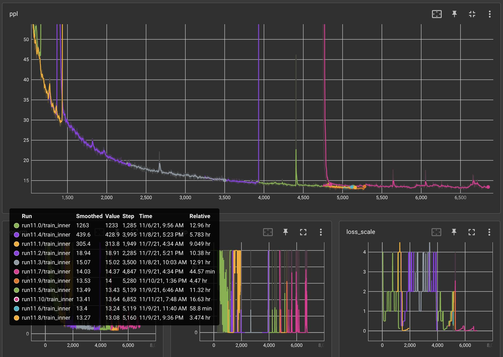
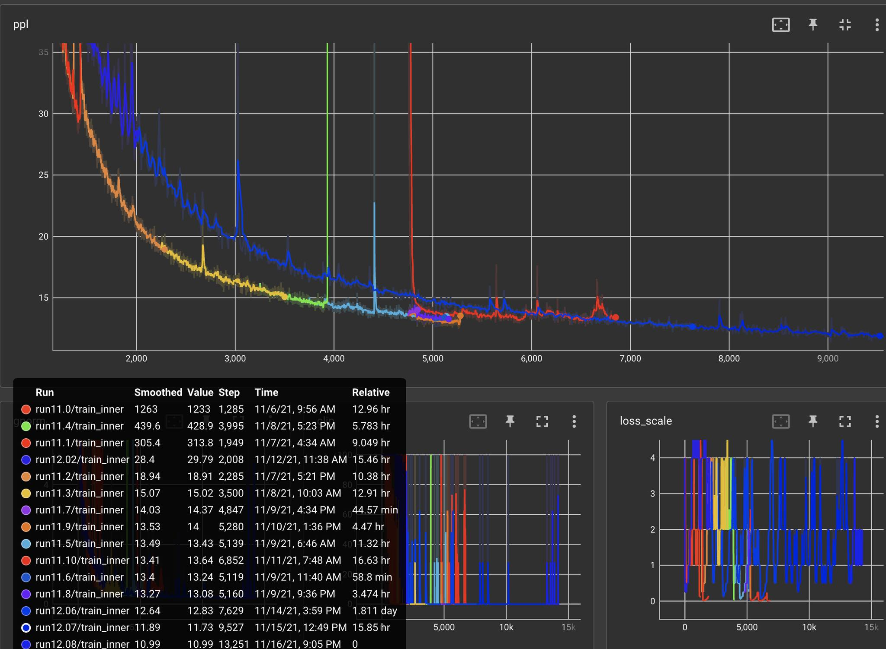
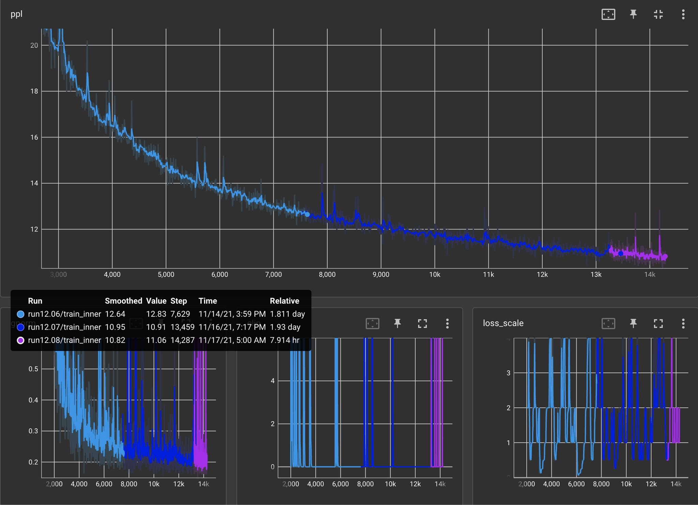
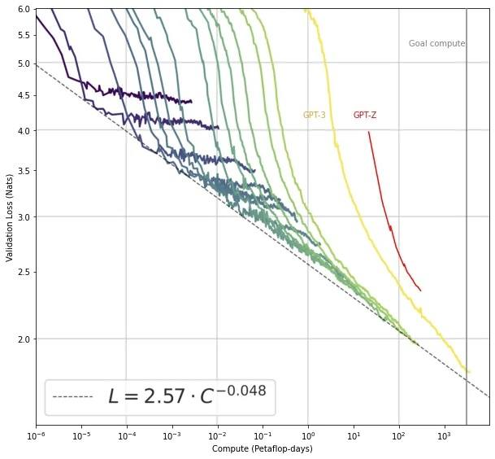

# Update on 175B Training Run: 10% through
**Written by:** Susan Zhang, Stephen Roller, Naman Goyal, Sam Shleifer, Myle Ott

**Posted on:** November 17, 2021

Over the past couple of weeks, the team has been working on launching the full 175B training run with tensor parallelism (TP), on an updated dataset taken from the Pile, CCNEWS, and Reddit.   Since the last post, the following has happened:

* Kicked off 1.3B parameter "kitchen-sink" runs (experiments 14-19) with TP to test stability of TP and various configurations of new deduplicated datasets, new BPEs, learned positional embeddings (LPE), Normformer, removing embedding dropout, and ReLU <> GeLU. 
* Found issues with the new dataset where perplexity was unreasonably low, which ended up being a combination of:
  * JSON encoding issues (extra backslashes got added in the dedup process)
  * whitespace / formatting issues (a function of the dataset itself)
  * general corpus issues (Enron/EuroParl/DM/StackExchange were all problematic without more complex formatting changes)
* After applying as much regex-ing as we could to salvage the dataset, we relaunched another set of experiments to test LPE (experiments 20-29) on the new dataset. 
* Unfortunately by then we were running out of time to launch the main 175B run and have it complete training on 300B tokens before EOY, so we terminated these small runs early after an initial sanity check on the newly re-formatted and filtered dataset.
  * We didn't have time to retrain a new BPE on the final dataset, so we fell back to using the GPT-2 BPE.
* Finally launched experiment 11.0 on November 5 at full 175B scale, and started the 11.xx lineage. 
* Also launched experiment 12.00 on November 11 at full 175B scale, and started the 12.xx lineage.

## Experiment 11.xx Lineage - November 5, 2021
We began this experiment lineage with the following settings:
* Batch-size of 2M 
* FP32 Adam 
* 8x Tensor Parallelism 
* New data from Experiment 29 
* LPE with sinusoidal initialization 
* Normformer 
* Weight decay of 0.05, LR of 3e-4, end LR of 1e-5, no dropout on embeddings, gradient pre-divide factor of 32, clipping of 2.5 (on L2 grad norm), Adam beta2 of 0.98 

In the first couple of runs where loss would explode, we were mainly focused on reducing LR, and increasing the frequency of clipping (by lowering clipping first to 1.5, and then to 1.0).  There were also an ECC failure in between, which led to another restart.  We also noticed validation time to have increased significantly from adding in per-corpus validation steps, along with validation on dialogue datasets, so we changed the frequency of validation and decoupled this frequency from the frequency of saving checkpoints.

From experiment 11.4 onward, we saw grad norm explosions / loss explosions / nans after a couple hundred updates after each restart, along with extremely unstable loss scales that would drop to the point of massively underflowing. We started taking more and more drastic actions then, starting with increasing weight decay to 0.1, lowering Adam beta2 to 0.95, lowering LR again, until finally by experiment 11.10 we hot-swapped in ReLU and also switched to a more stable MHA calculation (noting that the x**3 term in GeLU might be a source of instability with FP16). 
* Note that increasing weight decay and lowering Adam beta2 both have the effect of potentially noisier gradient updates, but with the benefit of faster "adaptation" to gradients from newer batches.

At the same time, we also found that our LPEs were not training, and a set of ablations were done within the RSC to figure out why.  TL;DR: the sinusoidal initialization of LPEs (with the rest of the model configuration) effectively froze the positional embeddings, which seemed to indicate a potential issue with our initialization scheme in general. 

Training Perplexity of our 11.xx runs

Zoomed in version of the training perplexity in our 11.xx runs, near the end

## Experiment 12.xx Lineage - November 11, 2021

By this point, even though we made it past 1k updates without grad norms exploding or nans everywhere, it appeared as if training was going to stagnate (see the pink line above of the training ppl from update 4750 to ~6700 with experiment 11.10). We decided to follow through with our "plan B" that we set for ourselves on October 18 before starting any of these runs, where we would abort from these configurations (derived from the lineage of all the previous dense experiments conducted with the Fairseq codebase) and adopt as much of the Megatron/OpenAI GPT-3 settings as possible.

* We chose this path due to the fact that we need 33 days to fully train at this scale with 1024 80GB A100s, and time was running out before EOY hit.  We also needed to buffer in time to evaluate this model on downstream tasks before EOY as well. 
* We could keep going down the path of tweaking the experiment 11.xx lineage, but we have no pre-existing knowledge we would be able to make consistent progress in that time. 
* Megatron/OpenAI GPT-3 settings are consistent with each other and have both been supposedly used to successfully train a 175B model (and above).

From all the things we changed in 11.xx, the main set of changes that were left to bridge the gap with Megatron/OpenAI settings were:

* Overall weight initialization 
* Removing Normformer, removing embedding scaling, and changing LPE initialization to standard embedding init and not sinusoidal init

In all the restarts, we added a lot more logging of gradients / param statistics, and also improved the checkpoint coalescing / restart logic (checkpoints are now sharded along an additional TP dimension, which needed to be stitched together, amongst other things).

On November 11, we started training our 12.00 experiment with all of these changes, and since then, the only restarts we've had to make were all related to hardware issues (missing GPUs on instances, training randomly hanging after including a new node, ECC errors, partial checkpoint upload after hardware error,  CUDA errors, NCCL errors, etc.).

Training perplexity between experiments 11.xx and 12.xx (12.xx are mostly in blue)

Zoomed in to the most recent state of 12.xx experiments

Things look a lot healthier now (activation norms, grad norms, param norms all appear "sane"), so we're hopeful that this configuration remains stable as we continue training.  We are currently almost ~10% of the way through, assuming we are still training for ~300B tokens: our tokenized dataset is only around 180B tokens, and repeating data at this scale may not be desirable, so we may have to terminate before hitting 300B.  The next issue we may have to deal with would be around loss/ppl plateauing, but we'll cross that bridge when we get there.

* Note that the loss/ppl in the 12.xx experiments starts off much higher than in the 11.xx lineage, but from the increased stability ends up at a much lower loss/ppl after 7k updates.  Optimizing for the lowest loss/ppl early in training does not seem to necessarily guarantee a uniform shift in the loss curve, and watching out for these curvature changes (sacrificing for some higher loss/ppl early on) would likely be useful in the rest of our experiments as well.

## Comparison with GPT-3, 175B

From plotting our validation loss (nats) against our compute used for the 12.xx experiments (red line), we appear to be on track to match GPT-3, 175B training (yellow line).  Note the log10 x-axis, which means we still have ~9x more training time to go.

* Given that we don't have any of potential compute optimizations made in GPT-3, nor the full dataset that was used there, it seems to require more compute for us to reach the same loss as GPT-3 at 175B scale (which is why our curve is shifted to the right). 

