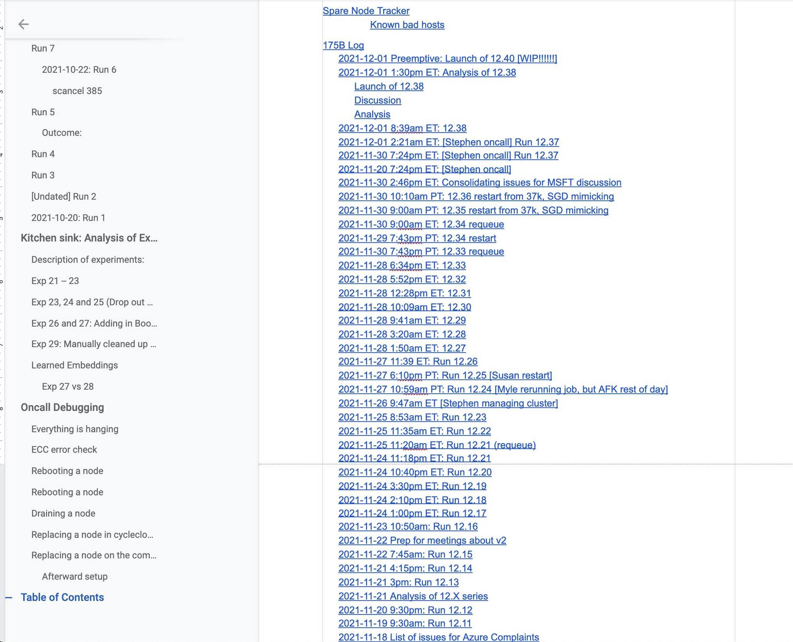
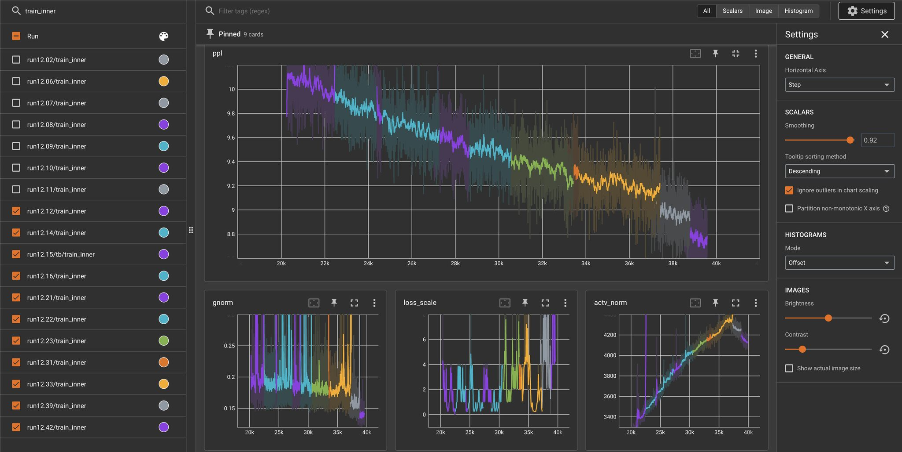

# Update on 175B Training Run: 27% through
**Written by:** Susan Zhang, Stephen Roller, Naman Goyal, Sam Shleifer, Myle Ott

**Posted on:** December 3, 2021

It’s been really rough for the team since the November 17th update.  Since then, we've had 40+ restarts in the 175B experiment for a variety of hardware, infrastructure, or experimental stability issues.

Screenshot of our logbook. This was our Thanksgiving "break".  Machines seemed to have enjoyed going on break then too.

The vast majority of restarts have been due to hardware failures and the lack of ability to provision a sufficient number of "buffer" nodes to replace a bad node with once it goes down with ECC errors.  Replacement through the cloud interface can take hours for a single machine, and we started finding that more often than not we would end up getting the same bad machine again. Nodes would also come up with NCCL/IB issues, or the same ECC errors, forcing us to start instrumenting a slew of automated testing and infrastructure tooling ourselves.  Some of these include:

* Replacing nodes through a script 
* Adding GPU burn-in testing to detect memory errors 
* Automating IB testing 
* Monitoring train.log

There were also issues with blob store when downloading 1.6TB of a single model checkpoint (992 files, each ~1.7GB) on restarts, at which point the downloads themselves would start hanging nondeterministically, which then delayed training recovery even further. The cloud provider's Python API, being poorly documented itself, seemed to require quite a bit of debugging to iron out, though we've managed to settle on a solution that seems sufficient for now.

All in all, working around infrastructure issues has dominated the last two weeks of the team's time, given that these hardware issues can take the experiment down for hours at any time of the day. While we were fully aware that these issues would come up during training at this scale, given the time crunch of shipping a trained 175B model by end of H2 2021, we had no choice but to launch and see how far we would get without this additional tooling.  Thanksgiving break was a painful reminder that automation on this front is necessary when training at this scale, and that cloud infrastructure instability is something to always prepare for, given lack of control over the underlying hardware.

Since the sleepless night of Thanksgiving break, this past week has been filled with gradient overflow errors / loss scale hitting the minimum threshold (which was put in place to avoid underflowing) which also causes training to grind to a halt.  We restarted from previous checkpoints a couple of times, and found that occasionally training would get a bit further (~100 or more steps) before hitting the same issue again.  At this point, we tried something a bit more drastic by testing out "SGD"-like settings for Adam (by setting beta1 to 0, and epsilon to 1), only to realize that reinitializing the Adam optimizer from a checkpoint also reloaded the previously saved betas.  We tried switching to true vanilla SGD then, which required implementing an FP16-friendly version immediately, only to find that our learning rate might have been set too low for SGD to actually make progress.

As of this morning, we have made the decision to continue with Adam but instead try lowering the LR, which seems to have a surprising effect on reducing gradient and activation norms and allowing perplexity to continue dropping steadily.  We had chosen initially to start with a much higher LR than GPT-3 175B, given ablations at smaller scale showing that GPT-3 LR settings were too low when trained in the fairseq codebase.  However, now that we are later in training, it seems like the LR may not be decaying fast enough to keep training stable.

After all the blood, sweat, and tears of these last few weeks, here is the final chart of progress since the last update:

We are also happily inviting people to join our on-call. We have established runbooks and some tooling for dealing with the most common issues.  Those who join this on-call will get firsthand experience at training a model at this scale, which will be valuable for all future large-scale efforts.  However, each hour the experiment stagnates or goes down costs us $$, so the goal of the on-call is to minimize this downtime.
