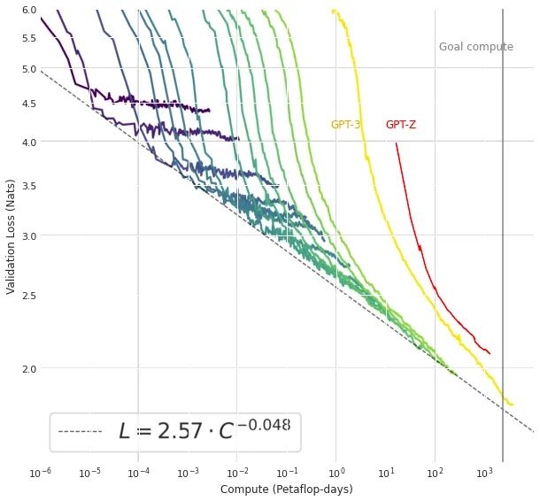
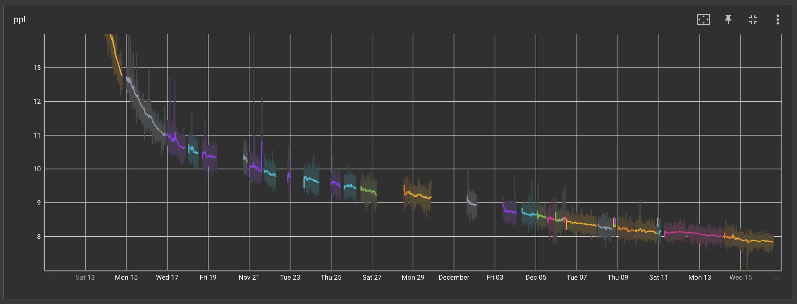
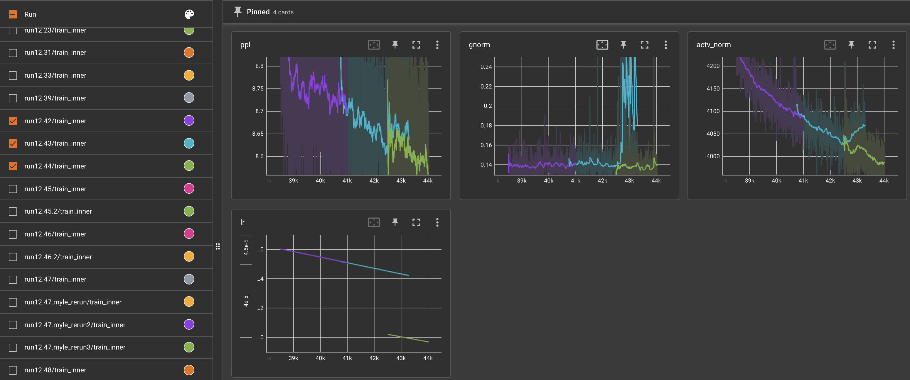
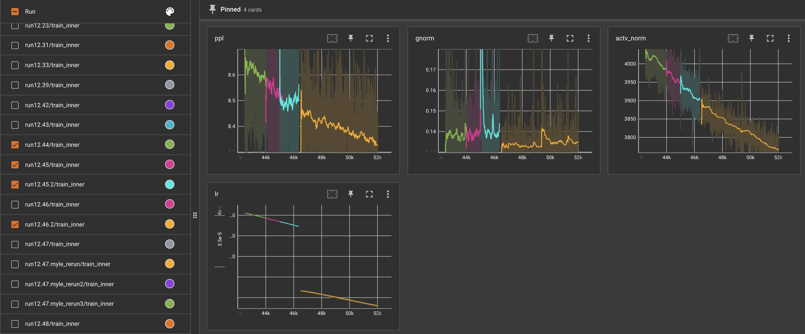
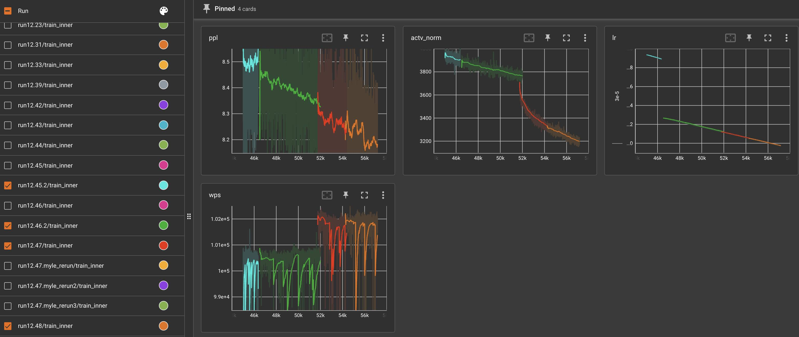

# Update on 175B Training Run: 56% through
**Written by:** Susan Zhang, Stephen Roller, Anjali Sridhar, Naman Goyal, Sam Shleifer, Myle Ott

**Posted on:** December 16, 2021

A lot has happened since our December 3rd update.  To recap:

* Infrastructure issues mentioned in the last update were escalated through the proper channels, and the team has since received additional compute for a larger "buffer pool" of machines that are ready to be swapped in when hosts go down. 
* The team has also received some additional compute to start de-risking the evaluation pipeline, though there are ongoing infrastructure issues with this cloud provider across multiple clusters and multiple teams that are finally being surfaced together.  We are continuing to work with our infra team to resolve these issues. 
* RSC is officially live, and we are continuing to work with the RSC team to raise hardware issues within the cluster, along with providing asks for general improvements to the developer experience workflow. 
* DeepMind just released details last week on their 280B Gopher model (GPT-style) that was trained a year ago (for reference, OpenAI released GPT-3 details on May 2020).
  * What goes unmentioned in all of these large-scale efforts is the amount of compute needed to run all of the experiments that help inform decisions about _how/what_ to scale. This will be something we need account for in the future as well, if we want to continue pushing the limits of these large-scale models.  In other words, allocating just enough compute budget to train a large-scale model won't be enough to guarantee a better model.

## Training Progress

We are now roughly 56% of the way through training, assuming we train for 300B tokens like the 175B OpenAI GPT-3 model.  However, our dataset currently only has a total of ~180B tokens, which means we are actually 93% of the way through if we stop at the epoch boundary.  The decision for when to stop training will depend on how our training / validation perplexity drops after the model starts "overfitting" to the dataset after one epoch.  Overfitting to the training data will likely lead to poor out-of-domain generalization, but we don't know this for sure until we start running downstream evaluation.

Updating the plot of our progress vs OpenAI's 175B GPT-3, we get:

<p align="center">

</p>

Note the log-scale of the x-axis.  As mentioned in our November 20th update, since we do not have the same dataset or training codebase as OpenAI, there will always be differences in the two loss curves.

## Infrastructure Stability
We managed to hit our top three record long runs of the experiment these past two weeks, lasting 1.5, 2.8, and 2 days each!  If we were to look at only the runs that have contributed to pushing training further and plot training perplexity against wall clock time, we get the following:


<p align="center">Those big holes were our Thanksgiving break.  Things are looking much better in recent weeks.</p>

Our cloud provider has also agreed to provision an extra 18 hosts for us to use as a "buffer" so that we can easily swap machines out when they go down with lost GPUs and ECC errors.  This has greatly reduced our experiment recovery time, especially considering 5 hosts going down all together on Dec 6 (back when we only had a buffer of 4 hosts).  We continue to have weekly meetings with the cloud infra team, and now we also have additional help from business development team to push for better support and turnaround time.

### On-Call
A quick shoutout to our collaborators who have volunteered to be on-call since our last post! Moya Chen, Kurt Shuster, Punit Singh Koura, Mikel Artetxe, and Dániel Simig have already started their on-call rotation this week (paired with each of the existing team members as "shadowers").

## Training Stability

Infrastructure issues aside, there have also been a few close calls with training stability. On run 12.43, we noticed grad norm and activation norm starting to spike/drift (light blue curve):



In response, we lowered our learning rate by 10%, which was sufficient for stabilizing our grad norm and activation norm. This happened again on run 12.45.2 (below), where our training perplexity started to diverge (light blue) after a few large grad norm spikes.  We lowered our learning rate at this point to 2/3 of what OpenAI 175B GPT-3 used, and managed to continue training.



At the same time, Sam worked on a set of ablations to test out activation clamping as another method of remediating these instabilities. See his post for more details.

Another avenue we would like to explore is to precondition the training run into a "stable region" (aka test different initialization schemes).  One such approach may be to use the eigenvalues of the loss Hessian, though work on this front is still in a very early stage.

## Megatron v2.6 vs v2.4

One interesting change in our training dynamics occurred when we accidentally upgraded our Megatron dependency to 2.6 (from 2.4). We noticed that all of a sudden, the trajectory of our activation norm changed significantly (red and orange lines), while our throughput (wps = words per second) increased by 2%:



Myle ended up chasing this down to a one-line change in Megatron which prevents the following code from executing:

```torch._C._jit_set_profiling_executor(False)```

We are still unclear why this one-liner affected training dynamics the way it did.  We will have to circle back to this once we have more compute / time to spare.

## Evaluation @ 175B Scale

Evaluation at 175B scale brings its own set of challenges and difficulties, especially given the fact that the majority of our compute capacity is currently reserved for training. Code that is tested on 32GB V100s on one of our clusters does not necessarily work on our 80GB A100s, and ongoing issues with our 40GB A100s have also prevented us from running any workload of significant size there. Infrastructure issues aside, Sam, Naman, Todor, and Anjali have been working together to make evaluations accessible to the wider team, which include changes such as:

* Consolidate shards and remove Adam parameters 
* Re-shard (slice) the consolidated checkpoints for FSDP to evaluate layer-by-layer 
* Completion of the end-to-end evaluations pipeline 

## Baselines

We are starting to establish baselines at smaller-scale to prepare for the next iteration of the 175B model.  These baselines are currently being used to de-risk all of our compute environments, though they eventually will serve as the "baselines to beat" in order for any architectural change to be incorporated into a larger-scale model.
