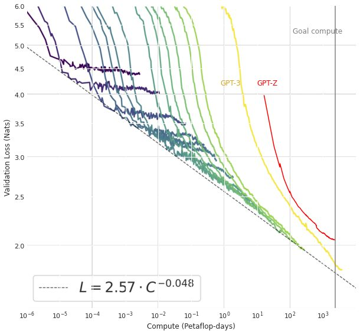
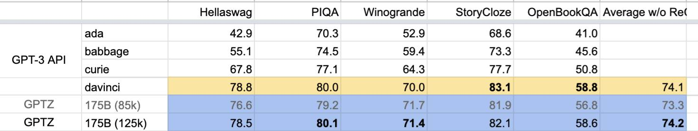

# 175B Training Run Completed
**Written by:** Susan Zhang, Stephen Roller, Naman Goyal, Sam Shleifer

**Posted on:** January 7, 2022

As of yesterday, at 12:46pm PST on January 6, our 175B model finally completed its training run on 300B tokens.  This required ~4.30E+23 FLOPs of compute, or roughly ~33 days of continuous training on 1024 80GB A100s (assuming no hardware issues, no numerical instabilities, etc.).

To frame this: 

* The 175B GPT-3 model trained by OpenAI required [14.8 days of compute on 10,000 V100s](https://arxiv.org/pdf/2104.10350.pdf), and consumed 3.14+23 FLOPs.  The code to do so is not open-sourced.
* A 1.1T Mixture-of-Experts model requires ~2.16+22 FLOPs of compute with 512 A100s. 
  * This is equivalent to a 6.7B dense model. 
  * A potentially useful metric to keep in mind is FLOPs/param on these trained models as a proxy for how much compute was used to "derive" each parameter.  For 1.1T MoE, that ratio is ~19.6+9.  For this 175B (dense) model, that ratio is ~2.5+12 (~125x higher than MoEs). 
* This was not a benchmarking exercise.  The model was trained to "completion" with a corpus of 180B tokens.  We did not have time to curate a larger dataset before training started, given a tight deadline to deliver by the end of H2 2021.
* Scaling to 1024 A100s to handle a real workload of this size is highly nontrivial. We will discuss infrastructure pain-points below. 
* Ensuring training converges at this scale is also highly nontrivial without sufficient ablations at "medium" scale.  Results obtained from training at "small" scale (< ~13B params) also do not necessarily hold when "scaled-up". We will cover these learnings in a note to be released in the upcoming weeks.

And to recap:

* [November 17th update](./10_percent_update.md) @ 10%: mainly faced training convergence/numerical stability issues
* [December 3rd update](./27_percent_update.md) @ 27%: mainly faced hardware issues
* [December 16th update](./56_percent_update.md) @ 56%: received more support with our cloud provider, received additional compute on another cloud provider to begin evaluating checkpoints from the model

For anyone who wants gory details of the entire effort, please refer to the 148 pages of notes the team has taken in the process, starting around the end of October.  These notes cover ~90 restarts over the course of training the lineage of this current model (experiments 12.xx).

## Cluster Deletion
Given the holidays, we requested a pool of 12 buffer nodes to guard against hardware failures (~2 machines go down every day). In the process of replenishing this pool, the cloud provider's support team accidentally deleted our entire cluster on December 21.  While the cluster was restored fairly quickly, it unfortunately came back with 16 machines that did not pass our infrastructure checks.  This was immediately escalated with the help of our TPM and by EOD we had the bare minimum number of machines needed to resume training. By EOD on December 23, we also had our buffer pool of machines replenished, though the cluster remained somewhat unstable throughout Christmas break.  Details on this incident can be found in the "Omicron SEV" section of our logbook.

In preparation for these failures, the team started gluing together all of our monitoring and health-checks for the cluster in order to enable fully automated recovery. It took several iterations to get right, but we were able to automatically recover from 8 hardware failures between Christmas and New Years, greatly reducing the burden of the on-call. We have set a January infrastructure goal of training at 175B scale for 14 days without human intervention, which will allow us to officially dissolve the role of the on-call.

## 175B Results

Our final validation loss curve, when compared with OpenAI's 175B GPT-3, ended up close, but not quite the same.  It seems like training with only 180B tokens in our dataset (as opposed to downsampling to 300B as GPT-3 did) may have led us to overfit on the training set and plateau earlier on validation.  And to reiterate from our November 17th note: we do not have the codebase, nor the full codebase used for the OpenAI GPT-3 training runs, and thus our loss curve, when plotted against the log x-axis of Petaflop-days, is shifted to the right.

However, our initial evaluation results, when compared with the OpenAI davinci API (a 175B model they are serving), seems very close on the following benchmarks:

